# How to setup and configure PPTP VPN tunnel on Windows Server 2008 to share internet traffic?

## Requirements
* "Windows Server 2008 Standard" or "Enterprise" or "Data Center edition". Not "Web edition"!
* This document is for Windows Server 2008 R2 but it almost same for Windows Server 2008.
* Your server should have at-least one valid IP.
* You should open TCP port 1723 and GRE protocol on your network firewall to able to connect to your server in the normal way, but if you don't have access to your network firewall you can use BarbaTunnel.
* One network Adapter, There is no need for two network adapters.

## Install "Routing and Remote Access Services"
1. Login to your Windows 2008 Server.
1. From start menu find and open "Server Manager" and go to "Roles" page then select "Add Roles".
	* 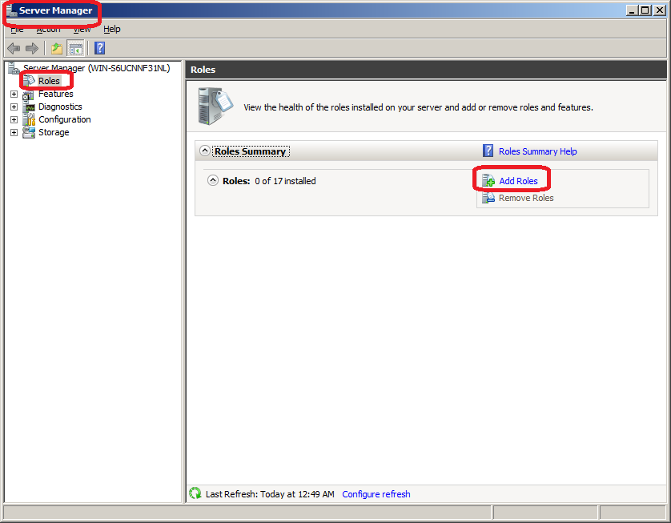
1. In "Add Roles Wizard" go to "Select Server Roles" page and select "Network Policy And Access Services".
	* 
1. Go to "Role Services" page and select "Routing and Remote Access Services". Make sure "Remote Access Services” and “Routing" items is selected too.
	* 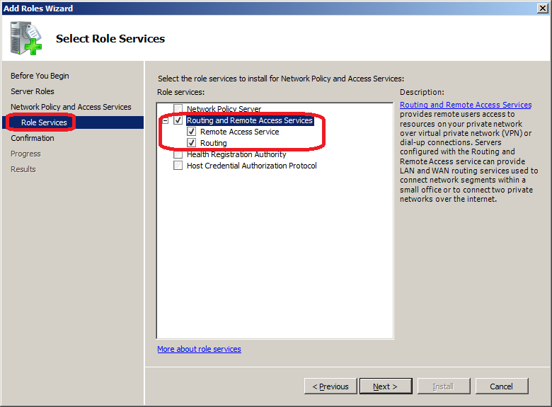
1. Follow the wizard and make sure the installation completed successfully then press "Close".
	* 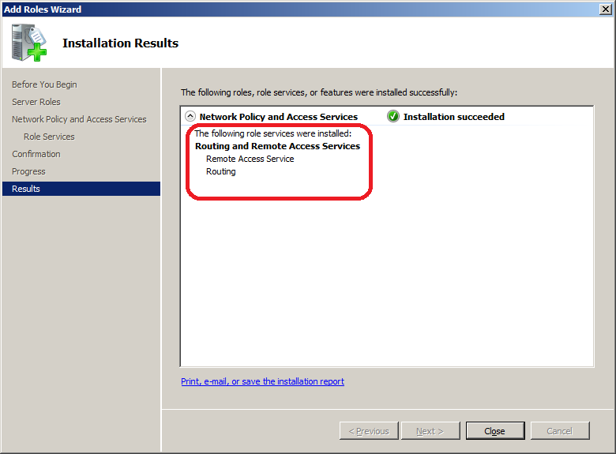

## Configure "Routing and Remote Access"
1. From start menu find and open "Routing and Remote Access". It is usually under "Administrative Tools" menu.
1. Select your Server Name and open its context menu by mouse right click then select "Configure and Enable Routing and Remote Access".
	* 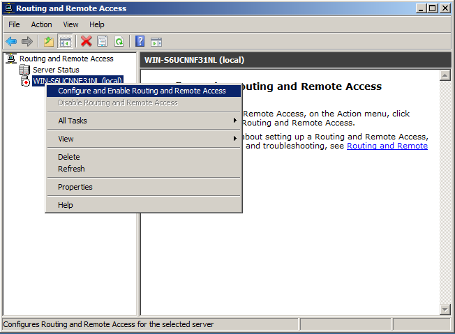
1. Step to "Routing and Remote Access Wizard" step to "Configuration" page and select "Custom configuration".
	* 
1. Step to "Custom Configuration" page select "VPN Access” and “NAT".
	* 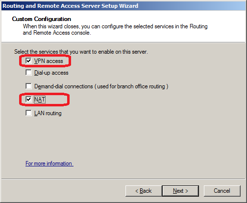
1. Make sure configured finished successfully and press "Finish".
	* 
1. After press finish it will prompt to "Start the Serivces" and you should press "Start service".
	* 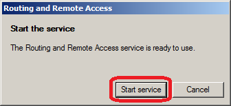

## Configure "NAT"
Servers usually does not have much valid IP, so you need to configure NAT to enable users to get Internet traffic from your server.
1. Open "Routing and Remote Access" and expand "your server" node then expand "IPv4" node, and select "NAT" item node.
1. Open "NAT" context menu by mouse right click and select "New Interface...".
	* 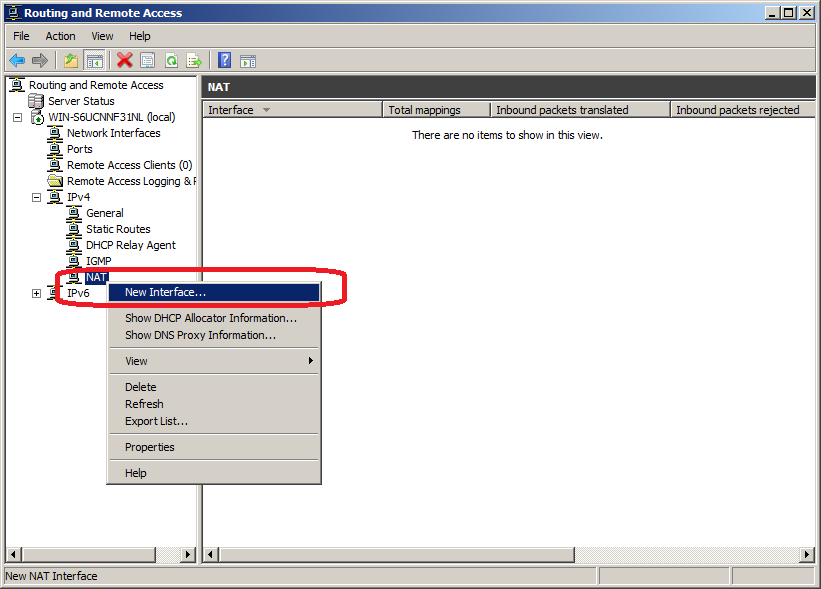
1. In "New Interface for IPNAT" Windows select "Internal" and click "OK".
	* 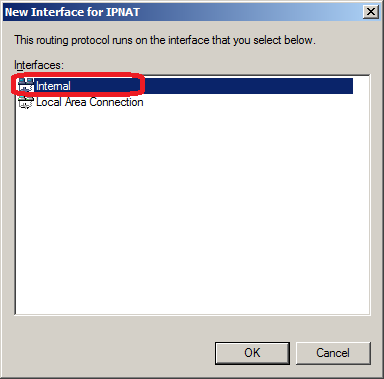
1. The "Network Address Translation Properties - Internal Properties" window will appear and just press "OK".
	* 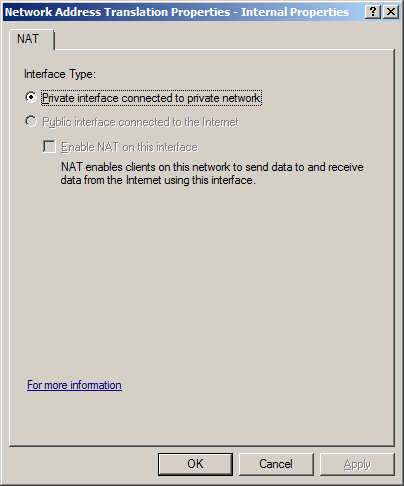
1. Again Open "NAT" context menu by mouse right click and select "New Interface..." and add "Local Area Connection" too.
	* 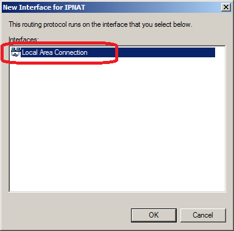
1. The "Network Address Translation Properties - Local Area Connection Properties" will appear. Select "Public interface connected to the Internet" and  select "Enable NAT on this interface" then press "OK".
	* 

## Configure "User Access"
By default users could not connect to your server via VPN unless you enable it.
1. Open "Routing and Remote Access" and expand "your server" node then select "Remote Access Logging and Policies" node. Open its context menu by press right click on the mouse and select "Launch NPS".
	* 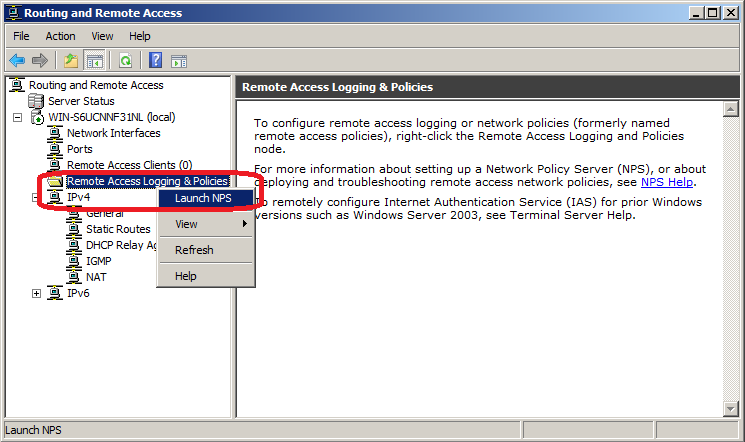
1. In "Network Policy Server" window select "Network Polices" node and open "Connections to Microsoft Routing and Remote Access server" item properties by double click on it.
	* 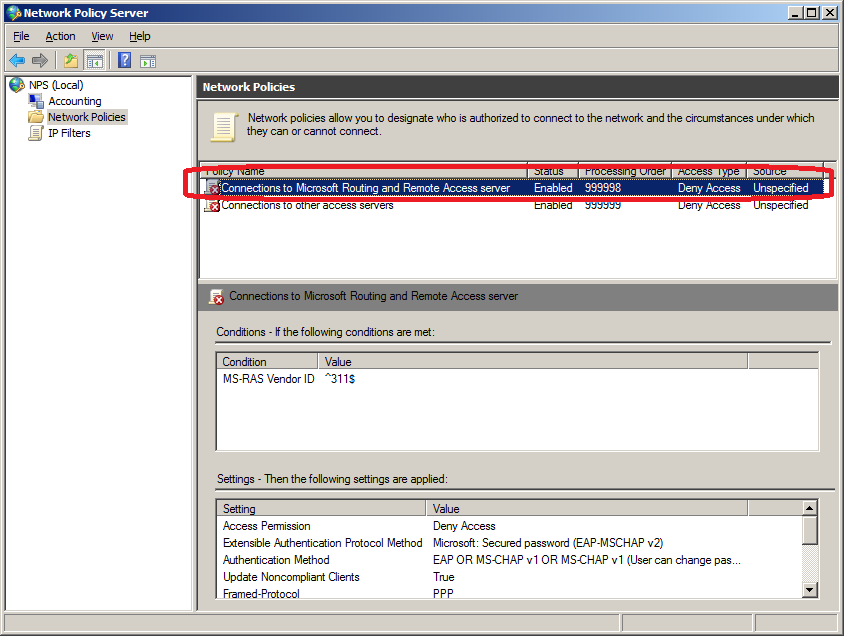
1. In "Connections to Microsoft Routing and Remote Access server properties" window go to "Overview" page and in "Access Permission" section select "Grant access. Grant access if the connection request matches this policy." and press "OK" and close "Network Policy Server" window.
	* 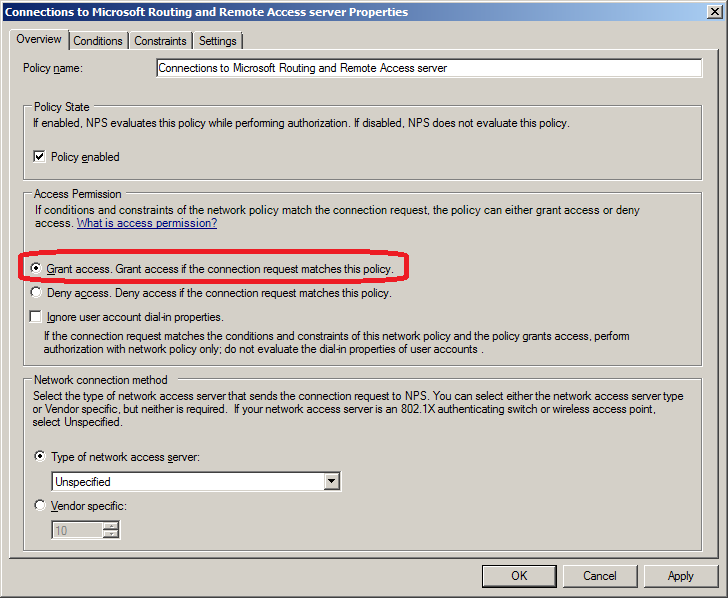

Your server is now ready to accept VPN connection and route network traffic for users in Windows Users.

## See Also
* [[How to disable multi-login on a same account on Windows Server 2008?]]

